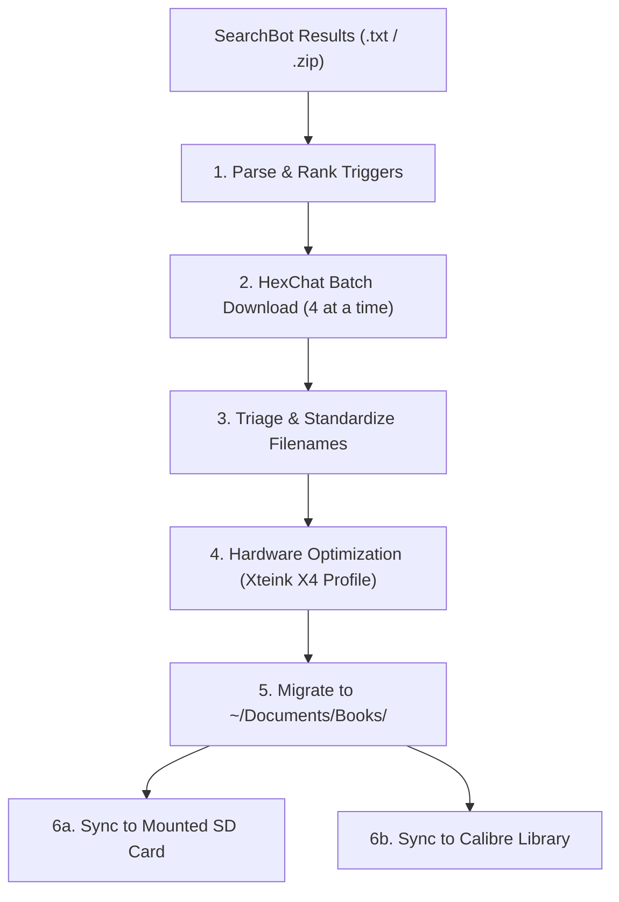

# E-Reader Book Prep

A complete pipeline for turning raw IRC book search results into optimized, crash-proof, perfectly formatted books for low-RAM e-paper readers (especially the **Xteink X4**, **X3**, and **M5Paper**), and syncing them to local SD cards and Calibre.



---

## Hardware Context: Why This Pipeline Is Essential

Devices like the **Xteink X4** (480×800 e-paper) run on an ESP32 microcontroller with only **4 MB to 8 MB of PSRAM**. 
- Modern retail EPUBs frequently embed 1500–3500px 24-bit RGB covers and illustrations.
- Decompressing a single 2000×1400 RGB image into raw memory requires **~11 MB of RAM**—instantly crashing an ESP32 e-reader upon opening the book or viewing the cover in the library.
- Even if the book doesn't crash, the microcontroller must downscale images line-by-line in software, causing multi-second page turns.
- **Goal:** Every image must be $\le 480 \times 800$, 8-bit grayscale (or 1-bit monochrome), with contrast boosted for e-ink, keeping decode RAM to **$\le 384\text{ KB}$**.

---

## Phase 1: Parsing SearchBot Results

When given a `SearchBot_results_for_<SearchQuery>.txt.zip` (or `.txt`) from IRC `#ebooks`:

Run the bundled parser:
```bash
python3 <skill-dir>/scripts/parse_searchbot.py <path-to-results.zip>
```

### Parser Rules:
1. **Format:** Strict `.epub` filtering (rejects `.mobi`, `.pdf`, `.rar`, `.html`).
2. **Bot Scoring:** Prioritizes reliable bots (`!Bsk` first, then `!Ashurbanipal`, `!Oatmeal`, `!Horla`, `!Firebound`). Strongly penalizes known broken/stalled bots (like `!Dumbledore`).
3. **Edition Scoring:** Prioritizes `(retail)` releases and clean `[Series NN]` volume naming.
4. **Deduplication:** Normalizes series brackets (`[]` vs `()`) and numbers (`01` vs `1`), picking the single highest quality trigger per volume.
5. **Batching:** Outputs triggers grouped into batches of 4.

To force a specific bot:
```bash
python3 <skill-dir>/scripts/parse_searchbot.py <file> --bot Bsk
```

To export as JSON for programmatic batching:
```bash
python3 <skill-dir>/scripts/parse_searchbot.py <file> --json --batch-size 4
```

---

## Phase 2: Batch Downloading via HexChat

IRC bots enforce strict flood controls and queue limits (e.g. `Allowed: 3 of 100`). Sending too many triggers at once causes dropped commands or rate-limiting.

### Trigger Protocol:
1. Dispatch **4 triggers at a time** into `#ebooks` via HexChat IPC:
   ```bash
   DISPLAY=:0 timeout 3 hexchat -e -c "msg #ebooks <trigger-1>"
   DISPLAY=:0 timeout 3 hexchat -e -c "msg #ebooks <trigger-2>"
   DISPLAY=:0 timeout 3 hexchat -e -c "msg #ebooks <trigger-3>"
   DISPLAY=:0 timeout 3 hexchat -e -c "msg #ebooks <trigger-4>"
   ```
2. Monitor transfer status in `~/.config/hexchat/logs/irchighway/#ebooks.log` or `~/Downloads/`.
3. Wait until the active DCC transfers complete (or queue slots clear) before firing the next batch of 4.

---

## Phase 3: Triage & Standardize Filenames

Run the bundled standardization script:
```bash
# Preview renames inside a directory or for specific files:
python3 <skill-dir>/scripts/standardize_names.py <path-to-dir-or-files> --dry-run

# Standardize series books in place (formats as: 01 - Title.epub):
python3 <skill-dir>/scripts/standardize_names.py <path-to-dir-or-files>

# Standardize standalone books (formats as: Title - Author.epub):
python3 <skill-dir>/scripts/standardize_names.py <path-to-file> --standalone

# Supply a manual series number for unnumbered sequels:
python3 <skill-dir>/scripts/standardize_names.py <file> --number 37
```

### The OPF-First Principle: Bridging E-Reader Filesystems and Calibre
To avoid conflicts between e-reader sorting and Calibre database ingestion:
* **The Conflict:** E-readers require `{two_digit_number} - {title}.epub` filenames to sort chronologically and avoid screen truncation. However, Calibre's default import parser expects `(?P<title>.+) - (?P<author>[^_]+)`, which mistakenly interprets `01` as the Title and `Half Magic` as the Author.
* **The Solution:** `standardize_names.py` automatically embeds the parsed metadata directly into the EPUB's `content.opf` (`<dc:title>`, `<dc:creator>`, `<meta name="calibre:series">`, and `<meta name="calibre:series_index">`).
* **The Outcome:** When Calibre imports the book via `calibredb add` or GUI, it reads the internal OPF metadata directly—completely bypassing the filename pattern and creating pristine database records with clean titles, correct authors, and proper series indices. The EPUB becomes 100% self-describing across both environments.

### Filename Rules & E-Reader Constraints:
1. **Series Books:** Formatted as `{two_digit_number} - {title}.epub` (e.g. `01 - Dinosaurs Before Dark.epub`). E-readers alphabetize files by name; leading zeros ensure book `10` does not sort before book `02`, and placing the number first prevents long author strings from truncating the title on narrow e-paper screens.
2. **Standalone Books:** Formatted as `{title} - {author}.epub` (e.g. `The Phantom Tollbooth - Norton Juster.epub`).
3. **Omnibus Editions:** Multi-volume spans are zero-padded (e.g. `[My Father's Dragon 01-03]` $\rightarrow$ `01-03 - Three Tales of My Father's Dragon.epub`).
4. **Junk Tag Scrubbing:** Strips pirate, OCR, and Calibre release tags such as `(retail)`, `(epub)`, `v3.1(RTF)`, and `(siPDF)`.
5. **Compound Word Repairs:** Automatically fixes squished words from OCR/Calibre titles (e.g. `Knight'sCastle` $\rightarrow$ `Knight's Castle`, `Seven-DayMagic` $\rightarrow$ `Seven-Day Magic`).
6. **Unnumbered Sequels:** Recent releases (e.g. *Magic Tree House* #37–#40) often lack `[Series NN]` bracket tags in search results; look up the canonical series index and pass `--number <NN>`.
7. **Branching & Regional Editions:** Preserve distinctive subtitles or dual titles in parentheses (e.g. `06 - Adventure on the Amazon (Afternoon on the Amazon).epub` vs `06 - Afternoon on the Amazon.epub`, or `29 - Christmas in Camelot.epub` vs `29 - A Big Day for Baseball.epub`) to avoid collisions between UK/US or mainline/spin-off editions.

---

## Phase 4: E-Paper Hardware Optimization

Run the bundled optimizer on the downloaded EPUB(s):

```bash
python3 <skill-dir>/scripts/optimize_epub.py <path-to-epub-or-dir> --profile x4
```

### Supported Profiles:
* `--profile x4` (Default): $480 \times 800$, 8-bit Grayscale, 1.10x contrast boost, JPEG Q80.
* `--profile x3`: $528 \times 792$, 8-bit Grayscale, 1.10x contrast boost.
* `--profile m5paper`: $540 \times 960$, 8-bit Grayscale, 1.10x contrast boost.
* `--profile safe`: $600 \times 800$, universal e-ink safe mode.

### What the Script Guarantees:
* **Memory Safety:** Clamps width and height to screen dimensions (aspect ratio preserved).
* **Color Stripping:** Converts 24-bit RGB covers and art to 8-bit grayscale (`L`).
* **Line Art Preservation:** Preserves 1-bit monochrome (`1` mode) PNG drawings without unwanted grayscale fuzziness.
* **Contrast Tuning:** Boosts contrast (+10%) so ink lines and pencil drawings pop on electronic paper.
* **EPUB Standard Compliance:** Writes `mimetype` uncompressed (`ZIP_STORED`) at byte offset 0.
* **Automatic Backup:** Saves uncompressed original in `_backup_original/` before modifying in place.

---

## Phase 5: Library Organization

Target directory structure: `~/Documents/Books/`

```text
~/Documents/Books/
├── Circle of Magic/
│   ├── 01 - Sandry's Book - The Magic in the Weaving.epub
│   └── _backup_original/
├── Magic Treehouse/
│   ├── 01 - Dinosaurs Before Dark.epub
│   └── _backup_original/
├── The Phantom Tollbooth - Norton Juster.epub
└── _backup_original/
```

- Standalone books live directly in `~/Documents/Books/`.
- Multi-book series get their own dedicated folder.
- Clean up duplicate or temporary files left in `~/Downloads/`.

---

## Phase 6: Syncing to Device & Calibre

Run the bundled sync tool:

```bash
# Auto-detects mounted SD card and Calibre library:
python3 <skill-dir>/scripts/sync_books.py

# Sync to SD card with deletion of removed/renamed files:
python3 <skill-dir>/scripts/sync_books.py --sd --delete

# Sync only to Calibre:
python3 <skill-dir>/scripts/sync_books.py --calibre

# Preview sync without writing:
python3 <skill-dir>/scripts/sync_books.py --dry-run
```

* **SD Card Sync:** Automatically locates automounted partitions (e.g. `/run/media/user/disk`) and syncs via `rsync -avui --exclude="_backup*"`.
* **Removable Storage Safety:** Automatically calls `os.sync()` after copying to flush all kernel page buffers to the physical flash drive, preventing corruption upon card removal.
* **Pruning (`--delete`):** Optional `--delete` flag removes older, bloated, or renamed EPUBs on the destination that no longer exist in `~/Documents/Books/`.
* **Calibre Sync:** Calls `calibredb add` in batch mode for all non-backup EPUBs, populating your Calibre database cleanly without creating duplicates.

### Cloud-Mounted & Remote Calibre Libraries (FUSE / GCS / S3)

If your Calibre library is hosted on cloud object storage (e.g. Google Cloud Storage mounted via `gcsfuse`, S3 via `s3fs`, or network shares):

> [!WARNING]
> **Never write directly to `metadata.db` over object storage FUSE.**
> SQLite relies on rollback journals (`metadata.db-journal`) with zero-offset truncations and random overwrites. Cloud object stores are append-only; FUSE drivers like `gcsfuse` reject random journal writes with `BufferedWriteHandler.OutOfOrderError`, causing `calibredb` to hang and lock the library indefinitely. Additionally, each individual book commit over FUSE forces a full re-upload of `metadata.db` (~2 MB) over the network.

**Recommended Remote Workflow (Local Staging):**
1. Copy `metadata.db` locally:
   ```bash
   mkdir -p /tmp/calibre_staging
   cp ~/mnt/lib-of-al/metadata.db /tmp/calibre_staging/metadata.db
   ```
2. Run `calibredb add` in a single batch against local staging (takes ~2 seconds for dozens of books):
   ```bash
   calibredb add --with-library /tmp/calibre_staging /path/to/books/*.epub
   ```
3. Copy new author/book folders to the cloud mount (using parallel copy or rsync):
   ```bash
   cp -r /tmp/calibre_staging/<Author> ~/mnt/lib-of-al/
   ```
4. Copy the updated `metadata.db` back to the cloud mount:
   ```bash
   cp /tmp/calibre_staging/metadata.db ~/mnt/lib-of-al/metadata.db
   ```
This reduces import times by >95% and avoids any risk of SQLite journal locking corruption.

